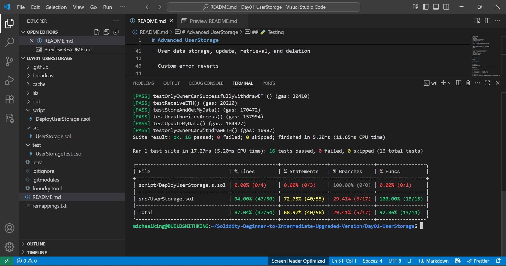

# Advanced UserStorage

A beginner-to-intermediate Solidity smart contract that enables users to securely store, update, retrieve, and delete their personal information on-chain. This project was built using Foundry and designed to practice advanced smart contract patterns, access control, custom errors, ETH withdrawal mechanisms, and Solidity testing with high coverage.

## 🚀 Project Summary
This project demonstrates core Solidity principles, including:
- Structs
- Mappings
- Custom Errors
- Events
- Access Control (OnlyOwner)
- Receive & Fallback Functions
- ETH Withdrawal Logic

### ✅ Features
- Store user data
- Update user data
- Retrieve personal or global data (by owner)
- Delete personal or global data (by owner)
- ETH deposit and withdrawal
- Custom errors for optimized gas usage

## 💻 Contract Deployment

- *Network*: Sepolia Testnet
- *Contract Address*: 0x6bCC4fd369Dc55B3f66f3aDD784E8cC7176363c2
- *Status*: Verified

## 🛠 Tools Used

- Language: Solidity `^0.8.18`
- IDE: [Remix](https://remix.ethereum.org/) + Visual Studio Code  
- Version Control: Git + GitHub (SSH)
- Foundry


## 🧪 Testing

The project includes a full Foundry test suite covering:

- User data storage, update, retrieval, and deletion

- Custom error reverts

- Owner-only access restrictions

- ETH deposits and withdrawals

---
Current Coverage: 87.04%

---

### Run tests locally with:

```
forge test
```

### Check Coverage with:

```
forge coverage 
```

## 🛠 Deployment

Deployed via Foundry script:

```
forge script script/DeployUserStorage.s.sol --rpc-url $SEPOLIA_RPC_URL --private-key $PRIVATE_KEY --broadcast --verify
```


### 📂 Project Structure

```
├── src/UserStorage.sol              # Main smart contract
├── script/DeployUserStorage.s.sol   # Deployment script
├── test/UserStorageTest.t.sol       # Comprehensive tests
└── foundry.toml                     # Foundry configuration
```

### 💡 Learning Notes

This project served as a personal upgrade from beginner to intermediate smart contract development using Solidity and Foundry.

Focus areas included struct and mapping mastery, advanced error handling, custom modifiers, event logging, and ETH management.

---

## 📄 License

MIT License – feel free to learn, remix, and build with it.

---

## ✍ Author

Built with 🔥 by [@BuildsWithKing](https://github.com/BuildsWithKing)  
Part of my [beginner-to-intermediate-upgraded-version](https://github.com/BuildsWithKing/beginner-to-intermediate-upgraded-version)

---

🙏 Kindly give credit ⭐ if this inspired your learning journey.

---